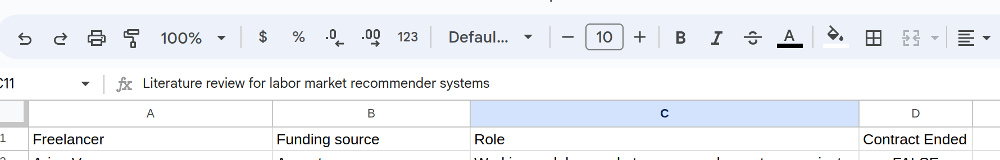
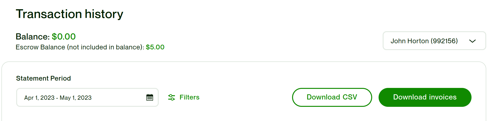
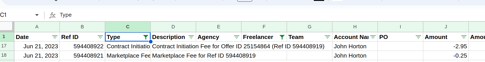
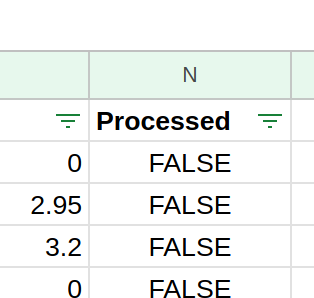

# Introduction 
1. Update any new freelancers with their name and funding source in the `freelancers` tab of the sheet

1. Download recent transaction statements and invoices from Upwork

1. Add CSV statements to the Google sheets `transactions` tab - be careful about duplicates!

1. Place PDF invoices in the correct folder: `upwork_invoices`

1. Create a new `gen_invoice_
.py` with correct filters
1. Run that invoice generation script  
1. Submit everything to the right person - make an entry in `submissions` tab of Google Sheets
1. Move the invoices to the `submited` folder
1. Update the Google sheet for the new transactions that have been processed so they are not re-processed

